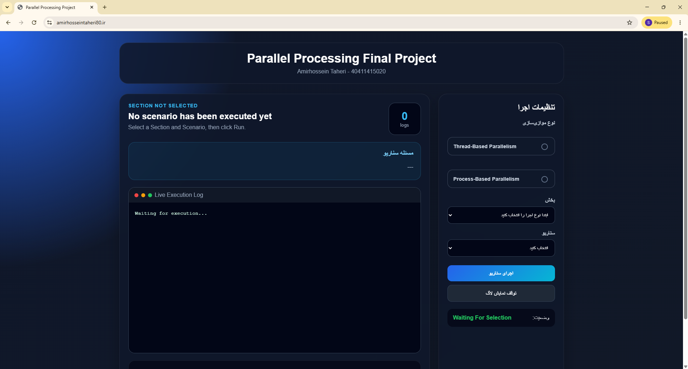
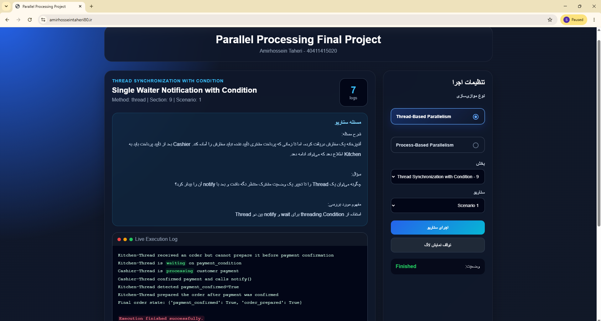
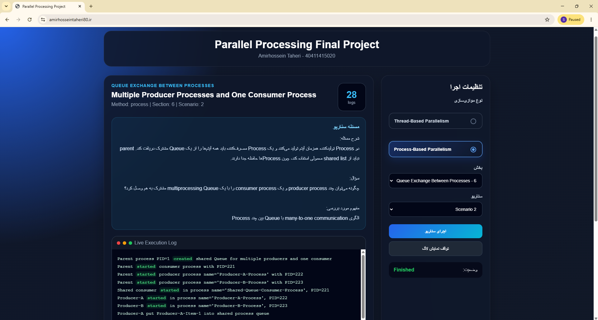
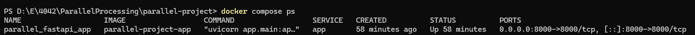
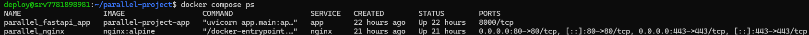
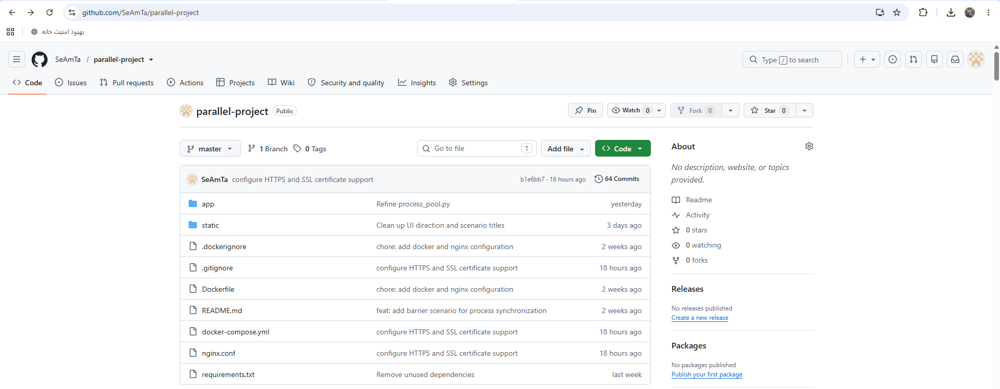

<div dir="rtl" align="right">

# پروژه نهایی پردازش موازی

یک برنامه وب آموزشی مبتنی بر **FastAPI** برای نمایش مفاهیم پردازش موازی، اجرای هم‌زمان، همگام‌سازی و ارتباط میان Threadها و Processها در زبان Python.

این پروژه به‌عنوان پروژه نهایی درس **پردازش موازی** طراحی شده است و مجموعه‌ای از سناریوهای عملی را از طریق رابط وب، REST API و خروجی زنده مبتنی بر Server-Sent Events در اختیار کاربر قرار می‌دهد.

---

## نسخه آنلاین پروژه

پروژه از طریق آدرس زیر در دسترس است:

<div dir="ltr" align="left">

[https://amirhosseintaheri80.ir](https://amirhosseintaheri80.ir)

</div>

مخزن پروژه در GitHub:

<div dir="ltr" align="left">

[https://github.com/SeAmTa/parallel-project](https://github.com/SeAmTa/parallel-project)

</div>

---

## معرفی پروژه

هدف این پروژه، آموزش عملی تفاوت‌ها و کاربردهای دو روش اصلی اجرای هم‌زمان در پایتون است:

<div dir="ltr" align="left">

1. **Thread-Based Parallelism**
2. **Process-Based Parallelism**

</div>

کاربر در رابط وب می‌تواند روش اجرا، شماره بخش و شماره سناریو را انتخاب کند. سپس برنامه اطلاعات زیر را نمایش می‌دهد:

- عنوان سناریو
- شرح مسئله
- خروجی واقعی اجرای برنامه
- توضیح آموزشی علت تولید خروجی
- روند اجرای مرحله‌به‌مرحله

این ساختار باعث می‌شود کاربر علاوه بر مشاهده نتیجه، رفتار واقعی Threadها و Processها را نیز هنگام اجرا بررسی کند.

---

## اهداف آموزشی

این پروژه با اهداف زیر پیاده‌سازی شده است:

- آشنایی با ایجاد و مدیریت Threadها
- آشنایی با ایجاد و مدیریت Processها
- بررسی تفاوت حافظه مشترک و حافظه مستقل
- شناخت مشکلات Race Condition
- کار با ابزارهای همگام‌سازی
- انتقال داده میان واحدهای اجرایی
- بررسی ترتیب شروع و پایان وظایف
- شناخت Process Pool و Worker Pool
- مشاهده خروجی برنامه به‌صورت زنده
- اجرای پروژه در محیط Docker و سرور واقعی

---

## قابلیت‌های اصلی

- رابط وب برای انتخاب و اجرای سناریوها
- Backend مبتنی بر FastAPI
- پشتیبانی از Threading و Multiprocessing
- نمایش خروجی مرحله‌به‌مرحله با Server-Sent Events
- ارائه REST API برای اجرای مستقیم سناریوها
- معماری ماژولار و قابل توسعه
- اجرای مستقل هر سناریو
- مدیریت خطاهای ورودی
- اجرای کانتینری با Docker
- استفاده از Nginx به‌عنوان Reverse Proxy
- پشتیبانی از HTTPS
- استقرار روی VPS لینوکسی
- راه‌اندازی خودکار کانتینرها پس از Restart سرور

---

## فناوری‌های استفاده‌شده

<div dir="rtl" align="center">

| فناوری | کاربرد |
|:---:|:---:|
| Python 3.11 | زبان اصلی پروژه |
| FastAPI | پیاده‌سازی Backend و API |
| Uvicorn | اجرای سرور ASGI |
| Threading | اجرای سناریوهای Thread |
| Multiprocessing | اجرای سناریوهای Process |
| Server-Sent Events | ارسال زنده خروجی به مرورگر |
| HTML | ساخت رابط کاربری |
| CSS | طراحی رابط کاربری |
| JavaScript | ارتباط رابط وب با Backend |
| Docker | کانتینرسازی برنامه |
| Docker Compose | مدیریت سرویس‌ها |
| Nginx | Reverse Proxy و مدیریت ترافیک |
| Certbot | دریافت و آزمایش تمدید گواهی SSL |
| Git و GitHub | کنترل نسخه و نگهداری کد |

</div>

---

## معماری پروژه

جریان کلی درخواست‌ها در نسخه مستقرشده به شکل زیر است:

<pre dir="ltr" align="left">
User
  |
  v
Domain + HTTPS
  |
  v
Nginx Reverse Proxy
  |
  v
FastAPI Application
  |
  +-- Thread Scenarios
  |
  +-- Process Scenarios
  |
  `-- SSE Stream
</pre>

در این معماری، Nginx درخواست‌های ورودی را دریافت کرده و به کانتینر FastAPI منتقل می‌کند. FastAPI سناریوی انتخاب‌شده را اجرا می‌کند و نتیجه از طریق API یا جریان SSE به مرورگر ارسال می‌شود.

---

## ساختار پروژه

<div dir="ltr" align="left">

```text
parallel-project/
│
├── app/
│   ├── __init__.py
│   ├── main.py
│   │
│   ├── routes/
│   │   ├── __init__.py
│   │   ├── thread.py
│   │   ├── process.py
│   │   └── stream.py
│   │
│   ├── services/
│   │   ├── dispatcher.py
│   │   │
│   │   ├── thread/
│   │   │   ├── defining_thread.py
│   │   │   ├── current_thread.py
│   │   │   ├── thread_subclass.py
│   │   │   ├── lock_sync.py
│   │   │   ├── rlock_sync.py
│   │   │   ├── semaphore_sync.py
│   │   │   ├── barrier_sync.py
│   │   │   ├── event_sync.py
│   │   │   ├── condition_sync.py
│   │   │   └── queue_sync.py
│   │   │
│   │   └── process/
│   │       ├── spawning_process.py
│   │       ├── naming_process.py
│   │       ├── background_process.py
│   │       ├── killing_process.py
│   │       ├── process_subclass.py
│   │       ├── queue_exchange.py
│   │       ├── process_sync.py
│   │       └── process_pool.py
│   │
│   └── templates/
│       └── index.html
│
├── static/
│   └── style.css
│
├── docs/
│   └── images/
│
├── Dockerfile
├── docker-compose.yml
├── nginx.conf
├── requirements.txt
├── .dockerignore
├── .gitignore
└── README.md
```

</div>

پوشه `certbot` شامل فایل‌های گواهی و کلید خصوصی فقط روی سرور نگهداری می‌شود و به دلیل مسائل امنیتی در GitHub قرار نمی‌گیرد.

---

## بخش‌های مربوط به Thread

قسمت Thread شامل **۱۰ بخش** است و هر بخش سه سناریوی متفاوت دارد.

<div dir="rtl" align="center">

| بخش | موضوع | مفاهیم اصلی |
|:---:|:---:|:---:|
| ۱ | تعریف Thread | `Thread`، `start`، `join` |
| ۲ | شناسایی Thread جاری | `current_thread`، نام Thread |
| ۳ | ساخت زیرکلاس Thread | بازنویسی متد `run` |
| ۴ | همگام‌سازی با Lock | Race Condition و Mutual Exclusion |
| ۵ | همگام‌سازی با RLock | قفل بازگشتی و فراخوانی تو در تو |
| ۶ | همگام‌سازی با Semaphore | محدودسازی دسترسی هم‌زمان |
| ۷ | همگام‌سازی با Barrier | انتظار گروهی Threadها |
| ۸ | همگام‌سازی با Event | ارسال سیگنال و توقف کنترل‌شده |
| ۹ | همگام‌سازی با Condition | `wait`، `notify` و `notify_all` |
| ۱۰ | ارتباط با Queue | FIFO، PriorityQueue و Task Tracking |

</div>

### نمونه مفاهیم بررسی‌شده در سناریوهای Thread

- تفاوت ترتیب شروع و پایان Threadها
- تأثیر استفاده زودهنگام از `join()`
- تشخیص Thread اصلی و Worker Thread
- نگهداری State در زیرکلاس Thread
- ایجاد عمدی Race Condition
- اصلاح Race Condition با Lock
- استفاده از RLock در توابع تو در تو
- محدودکردن تعداد وظایف هم‌زمان
- هماهنگی چندمرحله‌ای با Barrier
- توقف Graceful با Event
- پیاده‌سازی Bounded Buffer
- استفاده از Queue و Sentinel

---

## بخش‌های مربوط به Process

قسمت Process شامل **۸ بخش** است و هر بخش سه سناریو دارد.

<div dir="rtl" align="center">

| بخش | موضوع | مفاهیم اصلی |
|:---:|:---:|:---:|
| ۱ | ایجاد Process | `Process`، `start`، `join` |
| ۲ | نام‌گذاری Process | نام پیش‌فرض و سفارشی |
| ۳ | Process پس‌زمینه | Daemon و Non-Daemon |
| ۴ | متوقف‌کردن Process | Timeout، Event و Terminate |
| ۵ | ساخت زیرکلاس Process | بازنویسی `run` و Exit Code |
| ۶ | ارتباط با Queue | ارتباط یک‌طرفه و دوطرفه |
| ۷ | همگام‌سازی Processها | Value، Lock، Semaphore و Barrier |
| ۸ | Process Pool | `map`، `apply_async` و `imap_unordered` |

</div>

### نمونه مفاهیم بررسی‌شده در سناریوهای Process

- ایجاد یک یا چند Child Process
- بررسی PID والد و فرزند
- استقلال حافظه Processها
- تغییر رفتار بر اساس نام Process
- بررسی Exit Code
- تفاوت Daemon و Non-Daemon
- توقف کنترل‌شده با Event
- استفاده از `terminate()`
- انتقال داده با Multiprocessing Queue
- استفاده از Sentinel برای پایان پردازش
- ارتباط Request و Response
- متغیر مشترک با `multiprocessing.Value`
- محدودسازی دسترسی با Semaphore
- اجرای مجموعه‌ای از وظایف با Process Pool
- تفاوت ترتیب ورودی و ترتیب پایان

---

## مسیرهای API

### اجرای سناریوهای Thread

<div dir="ltr" align="left">

```http
GET /api/thread/{section}/{scenario}
```

نمونه:

```text
/api/thread/1/1
```

</div>

### اجرای سناریوهای Process

<div dir="ltr" align="left">

```http
GET /api/process/{section}/{scenario}
```

نمونه:

```text
/api/process/8/3
```

</div>

### دریافت خروجی زنده

<div dir="ltr" align="left">

```http
GET /stream/{method}/{section}/{scenario}
```

نمونه برای Thread:

```text
/stream/thread/1/1
```

نمونه برای Process:

```text
/stream/process/8/3
```

</div>

مسیر Stream از Server-Sent Events استفاده می‌کند و اطلاعات سناریو را به‌صورت مرحله‌به‌مرحله به رابط وب ارسال می‌کند.

---

## قالب پاسخ API

هر سناریو پاسخی مشابه ساختار زیر تولید می‌کند:

<div dir="ltr" align="left">

```json
{
  "method": "thread",
  "section": 1,
  "scenario": 1,
  "title": "عنوان سناریو",
  "problem": "شرح مسئله",
  "output": [
    "خط اول خروجی",
    "خط دوم خروجی"
  ],
  "explanation": "توضیح آموزشی نتیجه"
}
```

</div>

---

## اجرای پروژه بدون Docker

### ۱. دریافت پروژه

<div dir="ltr" align="left">

```bash
git clone https://github.com/SeAmTa/parallel-project.git
cd parallel-project
```

</div>

### ۲. ساخت محیط مجازی

<div dir="ltr" align="left">

```bash
python -m venv .venv
```

</div>

فعال‌سازی در Windows PowerShell:

<div dir="ltr" align="left">

```powershell
.venv\Scripts\Activate.ps1
```

</div>

فعال‌سازی در Linux یا macOS:

<div dir="ltr" align="left">

```bash
source .venv/bin/activate
```

</div>

### ۳. نصب وابستگی‌ها

<div dir="ltr" align="left">

```bash
pip install -r requirements.txt
```

</div>

### ۴. اجرای برنامه

<div dir="ltr" align="left">

```bash
uvicorn app.main:app --reload
```

</div>

پس از اجرا، برنامه در آدرس زیر در دسترس است:

<div dir="ltr" align="left">

```text
http://127.0.0.1:8000
```

</div>

---

## اجرای محلی پروژه با Docker

فایل اصلی `docker-compose.yml` برای محیط سرور و اجرای Nginx همراه با HTTPS تنظیم شده است. به همین دلیل برای اجرای ساده در سیستم توسعه، یک فایل محلی به نام `docker-compose.override.yml` ساخته می‌شود. این فایل فقط روی سیستم توسعه باقی می‌ماند و وارد GitHub نمی‌شود.

محتوای فایل محلی:

<div dir="ltr" align="left">

```yaml
services:
  app:
    ports:
      - "8000:8000"

  nginx:
    profiles:
      - production
```

</div>

پس از ایجاد این فایل، اجرای محلی با دستور معمول Docker Compose انجام می‌شود:

<div dir="ltr" align="left">

```bash
docker compose up -d --build
```

</div>

آدرس نسخه محلی:

<div dir="ltr" align="left">

```text
http://127.0.0.1:8000
```

</div>

مشاهده وضعیت کانتینر:

<div dir="ltr" align="left">

```bash
docker compose ps
```

</div>

مشاهده Logها:

<div dir="ltr" align="left">

```bash
docker compose logs -f
```

</div>

توقف و حذف کانتینرهای محلی:

<div dir="ltr" align="left">

```bash
docker compose down
```

</div>

---

## سرویس‌های Docker در سرور

فایل `docker-compose.yml` شامل دو سرویس اصلی است:

### سرویس app

وظایف این سرویس:

- ساخت Image برنامه
- نصب وابستگی‌های Python
- اجرای FastAPI با Uvicorn
- در دسترس قراردادن پورت داخلی `8000`

### سرویس nginx

وظایف این سرویس:

- دریافت درخواست‌های HTTP و HTTPS
- انتقال درخواست‌ها به FastAPI
- مدیریت Reverse Proxy
- پشتیبانی از SSE
- Redirect کردن HTTP به HTTPS
- استفاده از گواهی SSL

هر دو سرویس با سیاست زیر اجرا می‌شوند:

<div dir="ltr" align="left">

```yaml
restart: unless-stopped
```

</div>

بنابراین پس از Restart عادی سرور، کانتینرها به‌صورت خودکار دوباره اجرا می‌شوند.

---

## تنظیمات Nginx

Nginx درخواست‌های کاربر را به سرویس FastAPI منتقل می‌کند:

<div dir="ltr" align="left">

```text
Browser → Nginx → FastAPI
```

</div>

برای جلوگیری از اختلال در خروجی زنده SSE، تنظیمات زیر در Nginx قرار گرفته‌اند:

<div dir="ltr" align="left">

```nginx
proxy_buffering off;
proxy_cache off;
proxy_read_timeout 3600;
proxy_send_timeout 3600;
```

</div>

این تنظیمات مانع Buffer شدن خروجی می‌شوند و اجازه می‌دهند پیام‌های سناریو بلافاصله در مرورگر نمایش داده شوند.

---

## استقرار روی سرور

پروژه روی یک VPS مبتنی بر Ubuntu مستقر شده است.

مراحل اصلی استقرار عبارت‌اند از:

1. نصب Docker و Docker Compose
2. دریافت پروژه از GitHub
3. ساخت Image برنامه
4. اجرای سرویس‌های FastAPI و Nginx
5. اتصال دامنه به IP سرور
6. فعال‌سازی فایروال
7. دریافت گواهی SSL
8. انتقال خودکار HTTP به HTTPS
9. آزمایش موفق قابلیت تمدید گواهی با Certbot
10. بررسی Logها و وضعیت کانتینرها

دامنه نهایی پروژه:

<div dir="ltr" align="left">

```text
https://amirhosseintaheri80.ir
```

</div>

---

## امنیت و SSL

برای ارتباط امن کاربران با برنامه، HTTPS فعال شده است.

اقدامات انجام‌شده:

- دریافت گواهی SSL معتبر از Let’s Encrypt
- پشتیبانی از TLS 1.2 و TLS 1.3
- Redirect خودکار HTTP به HTTPS
- نگهداری فایل‌های SSL خارج از Git
- قرار دادن پوشه Certbot در `.gitignore`
- آزمایش موفق تمدید گواهی با دستور `certbot renew --dry-run`
- بازکردن فقط پورت‌های ضروری در Firewall

فایل‌های خصوصی گواهی SSL در مخزن GitHub قرار نمی‌گیرند. برای ادامه فعالیت بلندمدت سایت، زمان‌بندی تمدید گواهی باید جداگانه تنظیم و کنترل شود.

---

## آزمایش پروژه

پروژه در سه سطح بررسی شده است:

### آزمایش سناریوهای Thread

<div dir="ltr" align="left">

```text
۳۰ سناریو = ۳ سناریو × ۱۰ بخش
```

نتیجه:

```text
30/30 OK
```

</div>

### آزمایش سناریوهای Process

<div dir="ltr" align="left">

```text
۲۴ سناریو = ۳ سناریو × ۸ بخش
```

نتیجه:

```text
24/24 OK
```

</div>

### آزمایش استقرار

موارد زیر با موفقیت بررسی شدند:

- اجرای FastAPI
- اجرای Nginx
- ساخت Docker Image
- اجرای Docker Compose
- دسترسی به رابط وب
- اجرای APIهای Thread
- اجرای APIهای Process
- نمایش خروجی SSE
- دسترسی از طریق دامنه
- Redirect از HTTP به HTTPS
- اعتبار گواهی SSL
- آزمایش تمدید گواهی با Certbot
- اجرای خودکار کانتینرها پس از Restart سرور
- اجرای مستقل نسخه محلی روی پورت `8000`

---

## تصاویر مراحل اجرا و استقرار

تصاویر مستندات پروژه در مسیر `docs/images` نگهداری می‌شوند.

### رابط وب پروژه



### اجرای سناریوی Thread



### اجرای سناریوی Process



### اجرای محلی با Docker



### وضعیت کانتینرهای سرور



### مخزن GitHub



> فایل‌های تصویری بالا باید با همین نام‌ها در پوشه `docs/images` قرار گیرند تا در GitHub نمایش داده شوند.

---

## نکات مربوط به خروجی‌ها

ترتیب خروجی Threadها و Processها همیشه کاملاً ثابت نیست؛ زیرا زمان‌بندی اجرای آن‌ها توسط سیستم‌عامل انجام می‌شود.

بنابراین ممکن است در اجرای مجدد یک سناریو:

- ترتیب بعضی پیام‌ها تغییر کند.
- یک Thread زودتر یا دیرتر تمام شود.
- ترتیب پایان Processها متفاوت باشد.
- PIDها تغییر کنند.

این رفتار خطای برنامه نیست و بخشی از ماهیت اجرای هم‌زمان است.

---

## توسعه‌دهنده

**سیدامیرحسین طاهری**

کارشناسی ارشد مهندسی کامپیوتر – گرایش نرم‌افزار

<div dir="ltr" align="left">

GitHub:

[https://github.com/SeAmTa](https://github.com/SeAmTa)

</div>

---

## جمع‌بندی

این پروژه یک محیط آموزشی کامل برای بررسی مفاهیم Threading و Multiprocessing در پایتون فراهم می‌کند.

ترکیب سناریوهای عملی، رابط وب، REST API، خروجی زنده، معماری ماژولار، Docker، Nginx و استقرار واقعی روی VPS باعث شده است پروژه علاوه بر اهداف آموزشی، یک نمونه کامل از طراحی و استقرار یک برنامه وب Python نیز باشد.

</div>
